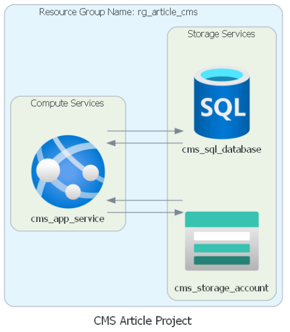

# CMS Project

## Project overview

It is the first project of the Cloud Developer using the Microsoft Azure Nanodegree Program. In this project, students deploy a simple Content Management System (CMS) for articles, where a user can log in, view published articles, and publish new articles. An article consists of a title, author, body of text (to be stored in an Azure SQL Server), and an image (to be stored in Azure Blob Storage).

The resources must be created and managed to fully deploy both the necessary storage and compute resources for the app to Azure. As part of the project, I analyze which resources are the best fit for app deployment between a VM or App Service. Lastly, I implement an authentication option to Sign in with Microsoft and log in for successful and unsuccessful logins.

The CMS includes the following components:

* A web app using Python with the Flask framework.
* A SQL database that contains a user table and an article table for the web app to query.
* A Blob Storage container where images are stored.

Below is a screenshot from the Python Web Application, viewing an article created successfully.

## Infrastructure of the project

The infrastructure of this project is humble, as depictec below.

## Technologies used:

* Pulumi

* Python
  * Flask
  * Diagrams

* Github Actions
* Microsoft Azure

